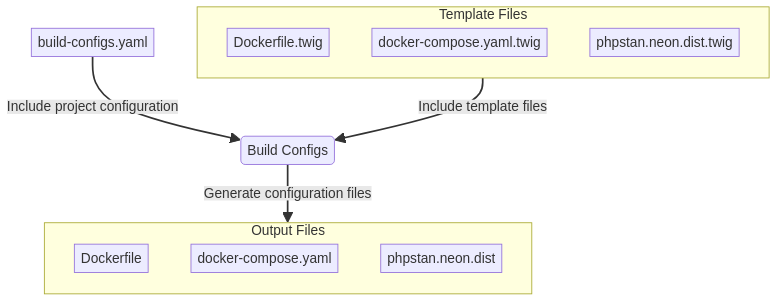

# build-configs

A CLI tool for generating build configuration files for PHP projects.

## Supported Projects

### PHP

- [Drupal](https://www.drupal.org)
- [Sculpin](https://sculpin.io)
- [Symfony](https://symfony.com)

### JavaScript

- [Fractal](https://fractal.build)
